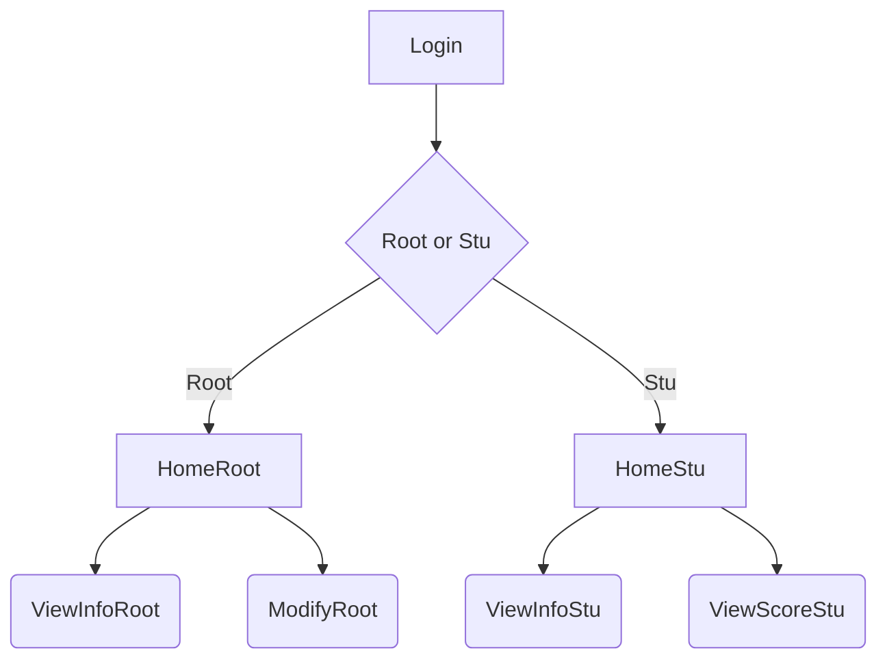

# ManageSystem
***

## 一、环境依赖
Windows10 或者 MacOS-Catalina  

Python3.8  

requirements.txt中的第三方库  

| 引用库 | 版本 |
|---------|-------|
| et-xmlfile | 1.0.1 |
| jdcal | 1.4.1 |
| numpy | 1.18.5 |
| openpyxl | 3.0.3 |
| pandas | 1.0.4 |
| Pillow | 7.1.2 |
| Pillow-PIL | 0.1.dev0 |
| python-dateutil | 2.8.1 |
| pytz | 2020.1 |
| scipy | 1.4.1 |
| six | 1.15.0 |
| xlrd | 1.2.0 |
| xlutils | 2.0.0 |
| xlwt | 1.3.0 |
***

## 二、部署步骤

1. 安装Python3.8  

2. 安装Pycharm  

3. 根据requirements.txt在Preferences中Project InterPreter安装第三方库  

4. 根据系统修改ManageSystem/src/ui/Login.py第208行  

5. 运行==ManagerSystem/src/ui/main.py==  
***

## 三、目录结构描述

├── src                                 // 代码包  
│   ├── lib                             // 资源文件夹  
│   │   ├── export.txt                  // Root用户导出信息存放处  
│   │   ├── gene_code.png               // 验证码图片  
│   │   ├── root.png                    // Root用户头像图  
│   │   ├── stu.png                     // Stu用户头像图  
│   │   └── Students.xlsx               // 存储学生信息的Excel表格  
│   ├── ui                              // 存放页面代码的包  
│   │   ├── __init__.py                 // 控制包的导入行为  
│   │   ├── HomeRoot.py                 // Root用户首页  
│   │   ├── HomeStu.py                  // Stu用户首页  
│   │   ├── Login.py                    // 登录页面  
│   │   ├── main.py                     // 主函数运行  
│   │   ├── ModifyRoot.py               // Root用户添加学生信息  
│   │   ├── UserID.py                   // 定义全局变量方便根据输入Stu用户名显示信息  
│   │   ├── ViewInfoRoot.py             // Root用户查看学生信息  
│   │   ├── ViewInfoStu.py              // Stu用户查看自己信息  
│   │   └── ViewScoreStu.py             // Stu用户查看自己成绩  
│   └── __init__.py                     // 控制包的导入行为  
├── README.md                           // Help  
├── requirements.txt                    // 依赖包列表  
└── setup.py                            // 安装部署工具  
***

## 四、页面流程图

***

## 五、预设用户名&密码
| 用户名 | 密码 |
|---------|-------|
| root | root |
| 20001 | 20001 |
| 20002 | 20002 |
| 20003 | 20003 |
| 20004 | 20004 |
| 20005 | 20005 |
| 20006 | 20006 |
| 20007 | 20007 |
| 20008 | 20008 |
| 20009 | 20009 |
| 20010 | 20010 |
***

## 六、版本内容介绍
### V1.0.0
<!--课程设计提交版本-->
#### 支持功能：
1. 登录页支持验证码验证，支持输入完回车确定登录  
2. 支持根据不同的Stu用户查看相应用户的信息  
3. Stu用户可以查看自己的基本信息和成绩  
4. Root用户可以查看所有学生信息和添加学生成绩  
#### 待改善：
1. 登录页验证码用户名和密码的代码过多  
2. 登录页点击更换验证码后关闭提示弹窗，验证码不显示  
3. 任意用户退出登录回到登录页时，验证码没有刷新  
4. Root用户查看学生信息表格未对齐  
5. Root用户只能添加学生单门成绩，而不能增删改除所有信息  
6. 每次点击按钮生成新的窗体，旧窗体不自动消失  
***

## 七、项目截图

***

## 八、其他信息
@Coding=UTF-8  
@Auther:Yan Chen, Fei JianLin, Yang Cheng, Tang YuHao  
@Time:2020-06  
@ProjectName:Student Information Management System  
@GitHub：Yan Chen(https://github.com/kirito66465)  
@Brief book：Yan Chen(https://www.jianshu.com/u/f52e7e7127b3)  